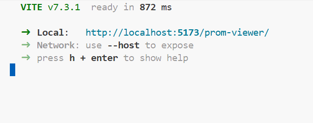

# PROM Viewer

> ⚠️ **Work in progress.** This README reflects the current state of development only. Sections may be incomplete or change as the project evolves.

## Description / Overview

PROM Viewer is a React + TypeScript web application for visualizing patient-reported outcome measures (PROMs) from FHIR data. It is built for clinicians who need to review questionnaire responses for a patient in a clear, chart-based interface. The FHIR profiles used are `Questionnaire`, `QuestionnaireResponse`, `Observation`, `ObservationDefinition` as defined by the [MII Erweiterungsmodul PRO (2026+)](https://simplifier.net/MII-Erweiterungsmodul-PRO-2025/~introduction) project.

Currently, the app does not connect to a real FHIR server. It runs against mock FHIR resources and configuration files served as static JSON from the `public/` folder. However, the app is designed to be launched as a SMART on FHIR application in production, where it will fetch real patient data from a FHIR server.

## Demo

There is a demo showing the current state of the app (mock data with no clinical meaning):
🔗 [PROM Viewer Demo](https://nadaguillermo.github.io/prom-viewer/)

## Installation

1. Clone the repository:

   ```bash
   git clone https://github.com/NadaGuillermo/prom-viewer.git
   cd prom-viewer
   ```

2. Install dependencies (this project uses Yarn):

   ```bash
   yarn
   ```

## Usage

Start the development server:

```bash
yarn dev
```

Other available commands:

| Command          | Description                          |
| ---------------- | ------------------------------------ |
| `yarn dev`       | Start the dev server with hot reload |
| `yarn build`     | Type-check and build for production  |
| `yarn preview`   | Preview the production build locally |
| `yarn lint`      | Lint the codebase                    |
| `yarn lint:fix`  | Lint and auto-fix issues             |
| `yarn format`    | Format code with Prettier            |
| `yarn typecheck` | Run TypeScript type checking         |

If the `yarn dev` command was executed successfully, the console output should look similar to this one:



## Features

- Visualizes FHIR questionnaire responses (mock data for now)
- Domain centered approach: questionnaire scores are grouped into domains to facilitate better cross-questionnaire comparability
- View responses of multiple different questionnaires simultaneously
- Export charts as PNG and table data as CSV
- Date and questionnaire filtering
- Display reference values in charts
- Configurable colors and date formats via config files

## Tech Stack / Built With

- **Language:** TypeScript
- **Framework:** React 19
- **Build tool:** Vite
- **Styling:** Tailwind CSS, daisyUI
- **Charting:** ECharts
- **Package manager:** Yarn
- **Other libraries:** FontAwesome, react-tooltip, html-to-image, lodash, fhirclient

## License

Not specified yet. The project is intended to be released as open-source, with usage open to everyone.
